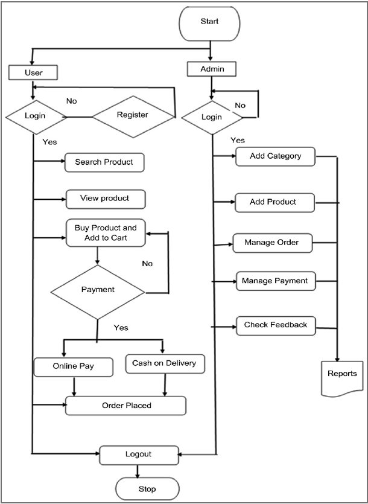

# E-Shopping System

## Introduction

The **E-Shopping System** is a C++ mini project designed to provide users with an online shopping platform. This system enables users to browse a product catalog, add items to a shopping cart, proceed to secure checkout, and manage their account details. Additionally, the system incorporates features for administrators to manage product listings, user accounts, and order details. With the increasing popularity of e-commerce, this project aims to offer a user-friendly interface while demonstrating key C++ concepts.

## Features

### User Side:
- **User Registration and Login:** Users can register and log in to their accounts securely.
- **Product Catalog:** Browse through a list of available products with detailed descriptions.
- **Shopping Cart:** Add items to the cart and manage the quantities before purchasing.
- **Checkout and Payment:** Secure payment and order confirmation.
- **Account Management:** Users can update their account information and view past orders.

### Admin Side:
- **User Management:** Manage user accounts, including viewing and editing user details.
- **Product Management:** Add, update, and delete products from the catalog.
- **Order Management:** View order details and manage orders efficiently.

## C++ Features Used

This project incorporates several key concepts of C++:

- **Object-Oriented Programming:** Utilizes classes, inheritance, polymorphism, constructors, and destructors.
- **File Handling:** Implemented functions such as `seekp()`, `seekg()`, `write()`, `read()`, `open()`, and `close()` for saving and retrieving user, product, and order data.
- **Formatting:** The `<iomanip>` library is used to format input/output for a polished and professional user interface.

## Screenshots
### System Flowchart

### User Interface

## Motivation

The motivation behind this project was to enhance our understanding of C++ programming by developing a practical application. The use of file handling, object-oriented programming, and other C++ concepts has given us significant hands-on experience.

## Individual Contribution

- **Sahil Choudhary**: Code and report
- **Yug Bhalodia**: Code and report
- **Tamanud Ghule**: Code and report
- **Aditya Bhale**: Code and report

